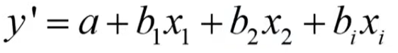
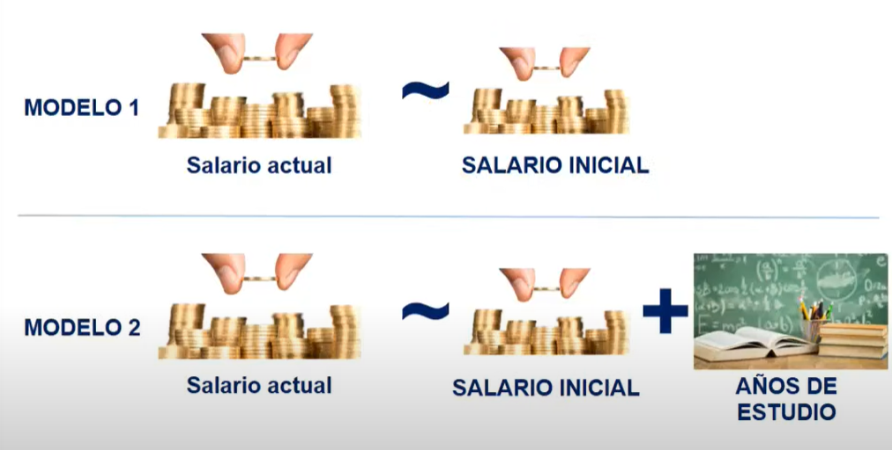
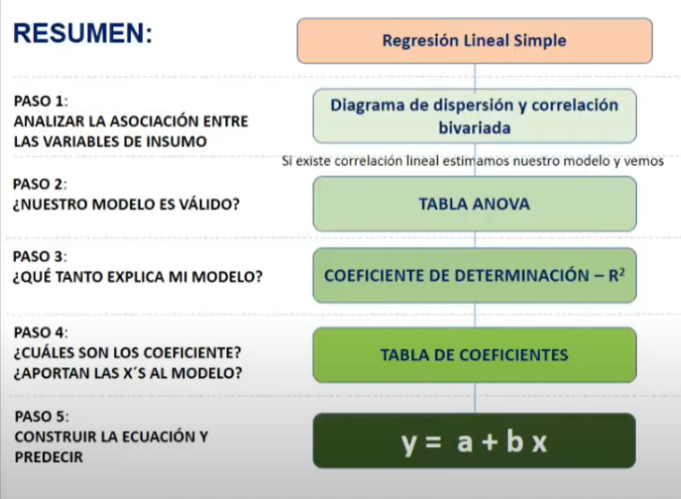

# Regresion Lineal Multiple (RLM)

Nos ayuda a conocer el valor de una variable a partir de más de una variable explicativa

-   Se agrega b1x1 por cada variable independiente que exista

-   Cada uno de los coeficientes *(b)* representa la influencia individual que cada una de las X tiene sobre Y

## ¿Utilizando RLM cómo son los pasos, pruebas e intercepcion?

En gran medida sigue el camino de intercepcion de la regresion simple pero con algunos puntos a considerar

 
