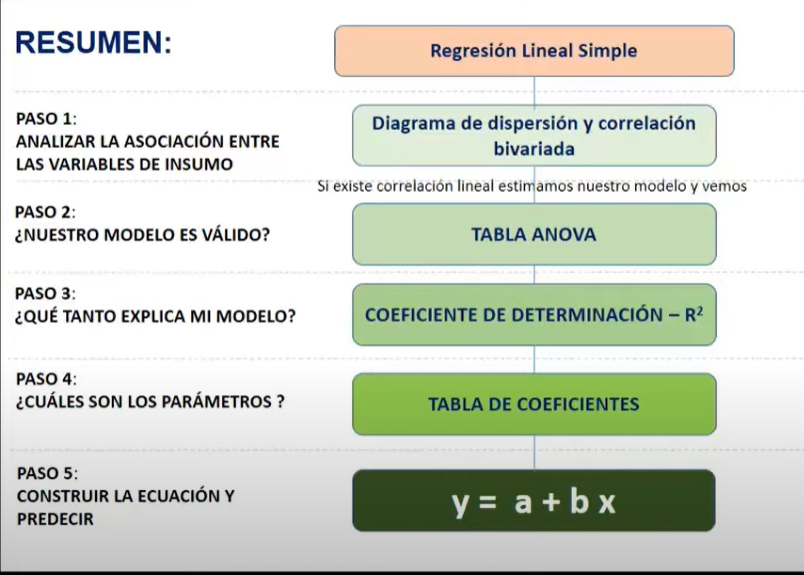
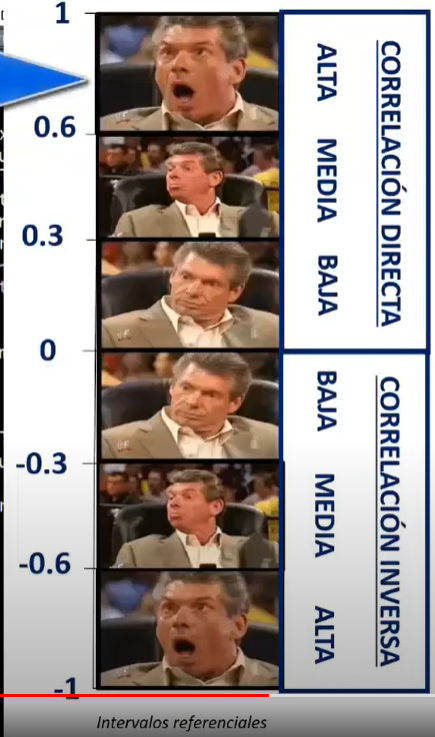
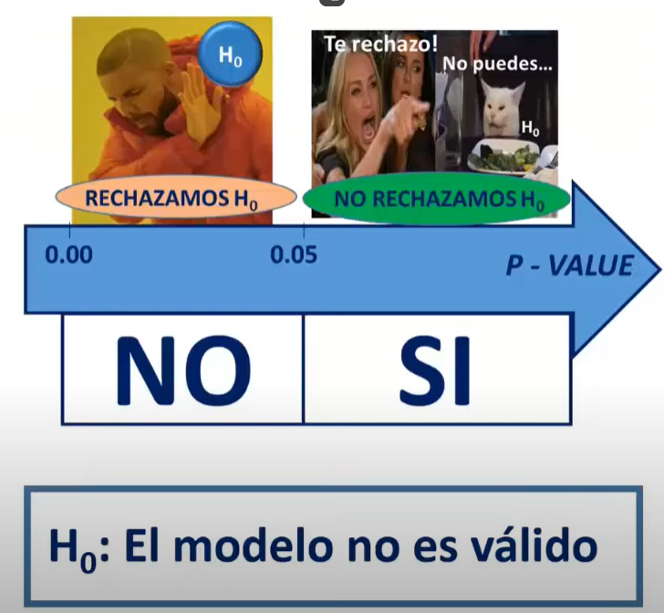
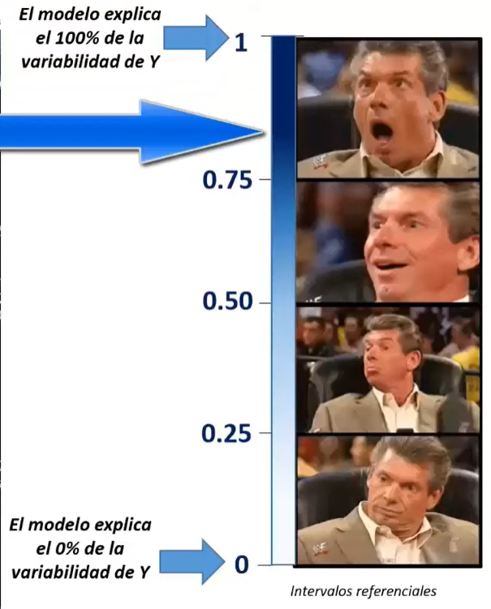
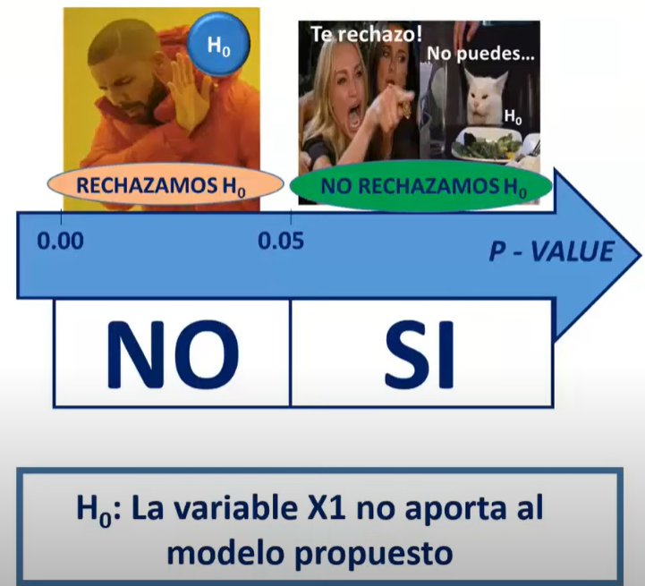
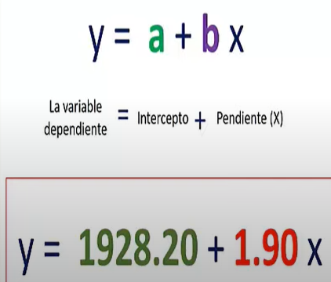

# Analisis de Regresión Lineal

Técnica estadística para predecir el valor de una variable con los valores de otra

## Paso 1: Correlacion

## Paso 2: p-VALUE

## Paso 3: R cuadrado

## Paso 4: Tabla de coeficiente

## Paso5: Construir la ecuacion

### output

