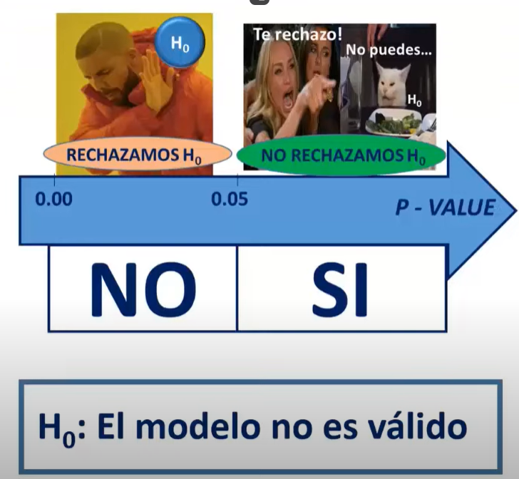
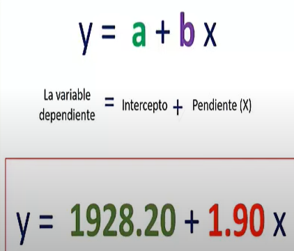
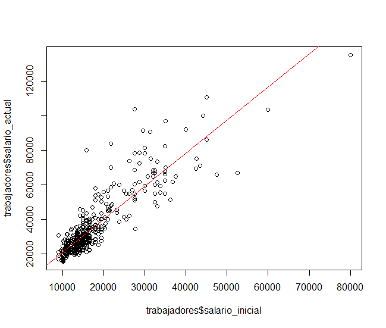

# Analisis de Regresión Lineal

Técnica estadística para predecir el valor de una variable con los valores de otra

## Paso 1: Correlacion

## Paso 2: p-VALUE

-   Tabla de anova es otra manera de corroborarlo

    **Hipotesis nula**: La variable X1 no aporta el modelo de regresion lineal simple -\> hay que aceptar o rechazar segun p-value

## Paso 3: R cuadrado

## Paso 4: Tabla de coeficiente

p-value es menor a 0.05 (el alpha) enonces **se rechaza** la hipotesis y se concluye que salario inicial (x1) si aporta al modelo

## Paso5: Construir la ecuacion

### output

# Conceptos complementarios

Donde:

-   **intercepto**: donde intercepta la linea en el eje Y

-   **pendiente o coeficiente**: cuando varia el valor de Y por cada unidad de X

-   **Hipotesis nula**

