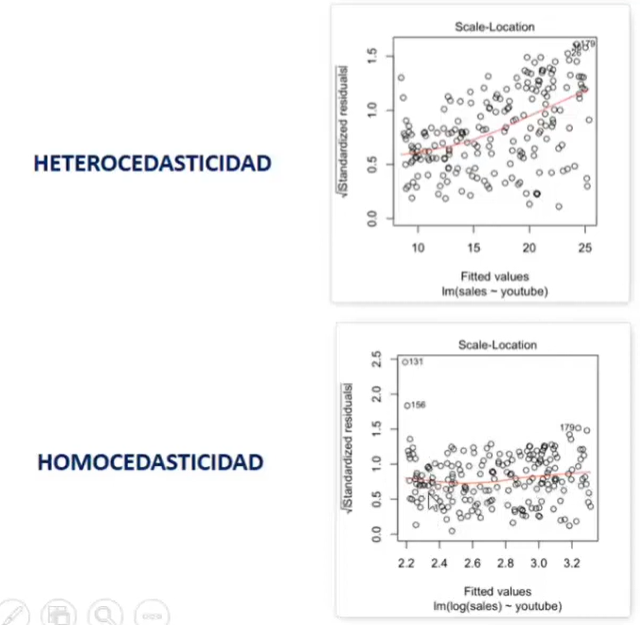

# Supuestos

En la mayoria de analisis, estos modelos necesitan si o si la **verificacion de un conjunto de supuestos para que su verificación sea la más adecuada**, es decir, se calcula un modelo de regresion lineal que no calcule estos supuestos puede que el modelo no de un buen resultado y por ende sea una mala estrategia

## 5 Supuestos a verificar

-   Linealidad
-   Normalidad de residuos
-   Homocedasticidad
-   Ausencia de multicolinealidad
-   Ausencia de valores influyentes

## Linealidad

#### **¿Que es?**

Se produce cuando existe una relación lineal entre las variable independientes y la variable dependiente

### ¿Por qué es un problema cuando no se cumple?

-   Se pueden cosiderar variables que no aporten al modelo.

-   Pueden existir relaciones no lineales

### ¿Cómo detectarlo?

Verificacion gráfica: Diagrama de dispersión entre valores predichos y los residuos

-   La linea roja debe ser horizontal

### ¿Qué se debe hacer si se detecta?

-   Aplicar transformaciones a las variables -\> ejemplo: log

-   Evaluar pertinencia de las variables en el modelo

-   Evaluar utilizar otra técnica estadística

## Normalidad de residuos

### ¿Qué es?

Cuando los residuos (no tipificados) del modelo no siguen una distribució normal

### ¿Por qué es un problema cuando no se cumple?

-   Porque no se podrían aplicar las pruebas de validación global del modelo (ANOVA)

-   Estas tienen como principal requerimiento que exista normalidad

### ¿Cómo detectarlo?

Calculando los rediduos Y:

-   Solicitar un Qqplot (*grafica)*

-   Realizar una prueba de normalidad (Shapiro Test)

### ¿Qué se debe hacer si se detecta?

-   Revisión detallada de las variables independientes

-   Transformación de variables

-   Aumentar el tamaño de la muestra

## Homocedasticidad de residuos

### ¿Qué es?

Cuando la varianza de los residuos es constante (*homocedasticidad*). Si no lo es, diremos entonces que el modelo es *heterocedástico*

### ¿Por qué es un problema cuando no se cumple?

-   Si existe un patrón puede ser que el modelo no funcione bien

-   Se asume que el error del modelo de regresión no afecta la varianza o dispersión de la estimación

### ¿Cómo detectarlo

-   Solicitar el gráfico de dispersión teniendo los redisups estandarizados en el eje Y, y los valores pronosticados en el eje X

    -   La línea roja debe tender a ser horizontal

-   Test Bruesch Pagan - H0: Existe homocedasticidad

### ¿Qué se debe hacer si se detecta?

-   Realizar transformaciones a las variables

-   Añadir más variables

## Ausencia de multicolinealidad

### ¿Qué es multicolinealidad?

Se produce cuando existe fuete (*o total*) correlación entre las variables independientes (las variables x´s)

### ¿Por qué es un problema cuando se presenta?

Cuando la colinealidad es alta produce coeficientes muy inestables en la ecuación, es decir, los efectos atribuidos a las variables independientes pueden ser engañosos

### ¿Cómo detectarlos?

-   Analizando el estadístico VF (factor de inflación de varianza)

-   Cuando es superior a 5, hay multicolinealidad

### ¿Qué se debe hacer si se detecta?

-   Aumentar el tamaño de la muestra

-   Crear indicadores múltiples combinando variables

-   excluir variables redundantes

## Identificacion de valores influyentes

### ¿Qué son?

Una observación influyente se define como **una observación que se diferencia marcadamente del conjunto de datos** y tiene una gran influencia en el resultado del modelo

### ¿Por qué son un problema?

Proque afecta los coeficintes de la ecuacion y genera errores en la predicción

### ¿Cómo detectarlos?

-   Se utilizan medidas de influencia, entre las que resalta la distancia de Cook

    -   Distancia de Cook \>= 1 indica que ese caso es un valor influyente

### ¿Qué se debe hacer si se detectan?

-   Identificarlos y evaluar qué pasó con estos casos

-   Estimar la ecución de regresión con esta observación y sin ella y ver el impacto real en los coeficientes

-   Eliminarlos del modelo
