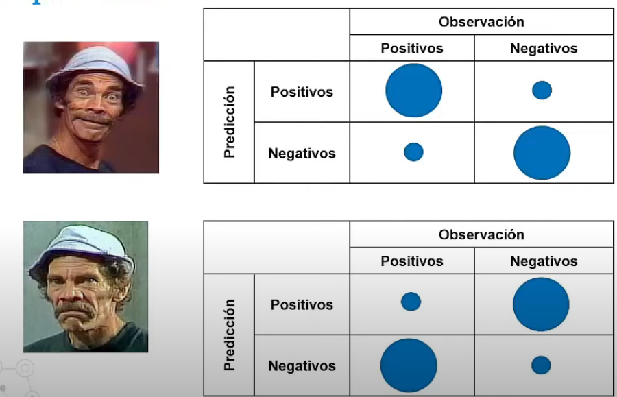

# Pasos Escenciales

0.  Identificar la variable dependiente y el conjunto de variables independientes

1.  Generarla con la funcion glm()

2.  Significa el saber cómo va a estar estructurada la ecuacion

    -   Por ejemplo los coeficientes de la ecuacion -\> con `summary(nuestro_modelo)`

3.  Saber la significancia de cada variable independiente

    -   Hay que recordar la prueba de hipotesis nula

        -   **H0:** No aporta al modelo

        -   **H1**: aporta al modelo

    -   Si el valor p-size es menor a 0.05 entonces se rechaza la hipotesis nula

4.  Calcular el Odds Ratio

5.  Ver las probabilidades para cada registro con `nuestro_modelo$fitted.value`

6.  Se elige un punto de corte: 0.5 (*por ejemlpo*)

    -   se agrega al dataset con:

        `dataset$predicho<-as.numeric(nuestri_modelo$fitted.values>=0.5)`

# 7. Evaluacion

-   Mediente la matriz de confusión
-   Es importante que ambas columnas (la del dataset y la predicha por el modelo) sean el mismo tipo, ejemplo numericas o factores

## Conceptos Clave

{width="493"}

{width="485"}

## Indicadores de evaluación

En base a la matriz de confusión, permite tener una métrica para comparar rendimiento de modelos

-   **Exactitud (Acurrancy)**: es la evaluacion general -\> ideal sobre le 80%

    

-   **Sensibilidad o tasa de verdaderos positivos**: solamente hace énfasis en los verdaderos positivos

    

-   **Especificidad o tasa de verdaderos negativos**: solamente hace énfasis en los verdaderos negativos

    
