# Conceptos Basicos

## Probabilidad

-   **Definicion:** Medida del grado de incertidumbre de que un evento pueda ocurrir

-   **Cálculo:** Número de veces que se representa el evento / Número total de intentos

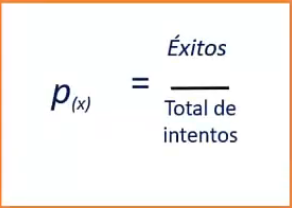

-   **Escala:** Número entre 0 y 1. Done 0 es igual a un suceso imposible y 1 a un suceso seguro

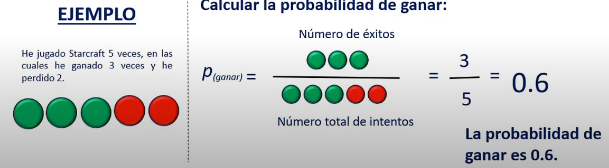

## Odds

-   **Definición**: *Medida de probabilidad relativa* que tiene un evento de ocurrir frente que no ocurra

-   **Cálculo:** *Ratio* entre probabilidad de que suceda el evento / Probabilidad de que no suceda

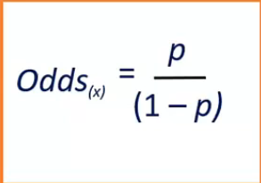

-   **Escala:** Va de 0 a infinito

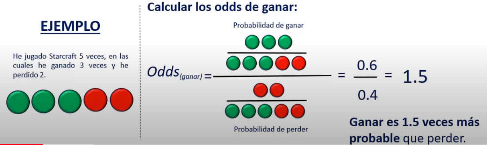

## Odds ratio

-   **Definición:** Es la razón entre dos odds. Permite comparar los odds de un evento en dos grupos

-   **Cálculo:** La división entre el Odds del evento X en un grupo 1 y el Odds del evento X en el grupo 2

    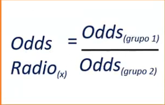

-   **Escala:** Va de 0 a infinito

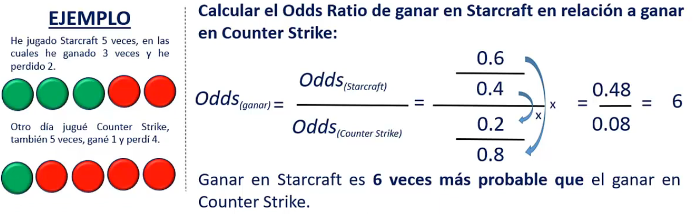

# Diferencia de variable Y (dependientes)

## Regresión lineal

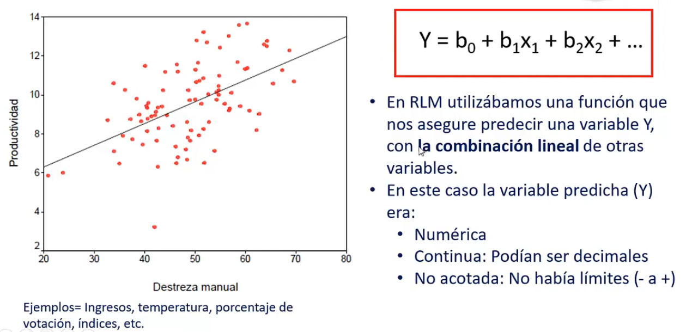

## Regresión Logística

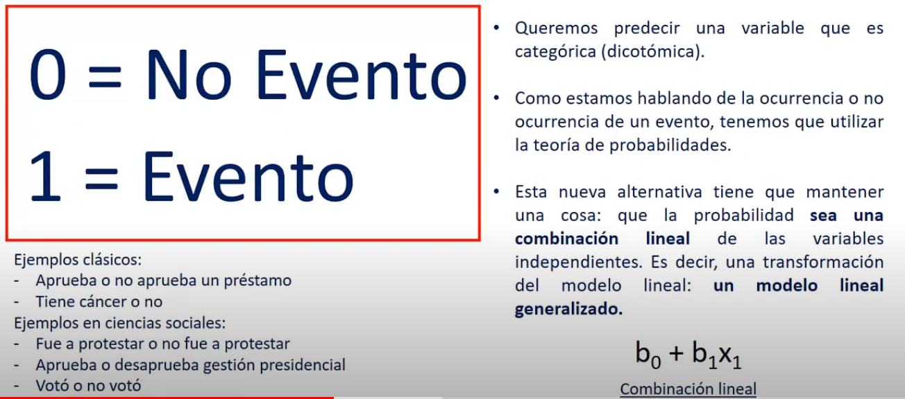

# Problema: Una nueva variable dependiente

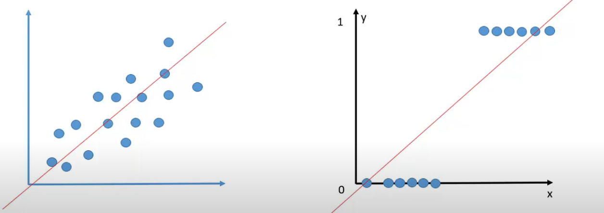

-   La regresión lineal ayuda a predecir una variable numérica, continua, no acotada, pero **no** una variable dicotomica. En RL la variable Y nos puede salir menor que 0 y mayor que 1 y no aplicaría.

-   Esto nos obliga a buscar una forma alternativa para predecir el evento que no sea **no lineal**. Esta forma debe tener una variable Y que se encuentre entre 0 y 1.

# Funtamentos Teóricos

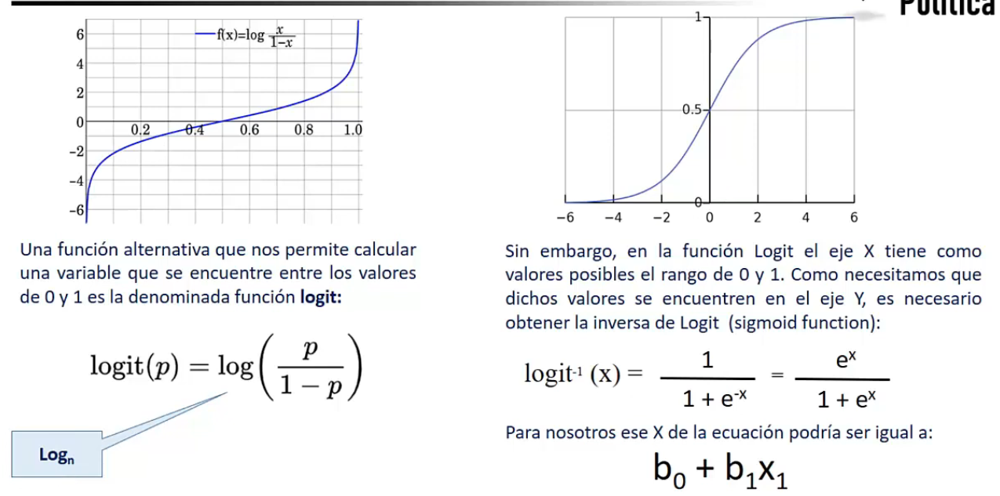

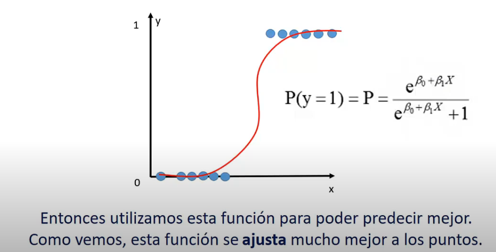

# Un modelo de clasificación

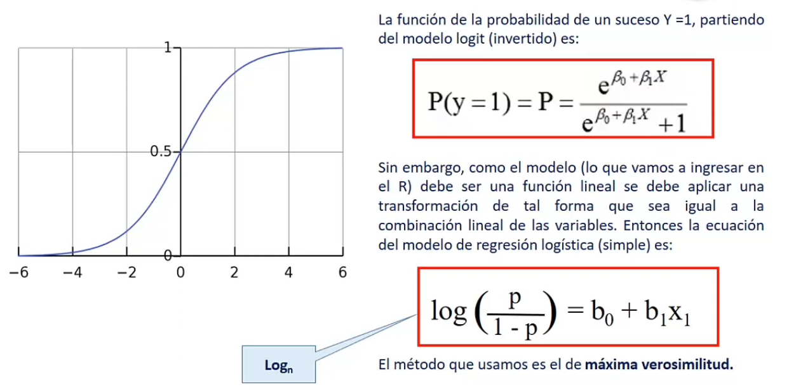

# Características

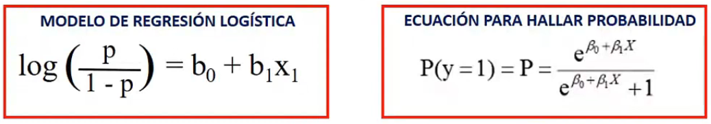

1.  **Modela** la probabilidad de que ocurra un evento partiendo de un conjunto de variables (*halla coeficiente y construya una ecuación)*
2.  **Estima** la probabilidad de que un evento ocurra para una observación al azar vs la probabilidad de que no ocurra (*Odds)*
3.  **Predice** el efecto de una serie de variables en una variable categórica binaria
4.  **Clasifica** observaciones a través de la estimacion de la probabilidad de que se encuentre en una categoría determinada

# Resumen

-   No se usa la regresion lineal porque no se ajusta a la forma de **esta nueva variable dependiente** (*ya que es una variable categorica binaria)*

-   Se buscó una fórmula alternativa que mantenga la combinacion lineal que ya se tenia en la regresion lineal, y se encontró la función **logit**

    -   De **logit** se ha derivado la probabilidad de que sucesa, y se tienen 2 ecuaciones {width="513"}

    -   Esas 2 funciones estan íntimamente relacionadas, ya que **de ellas surge el modelo de regresión logística**
